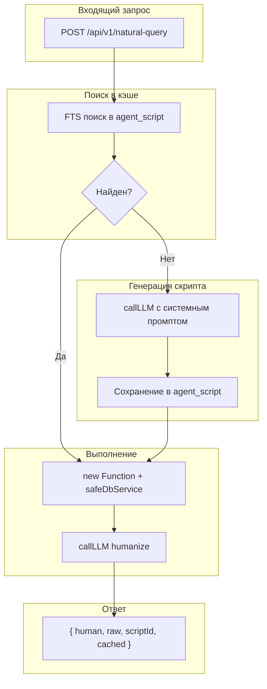

# Natural Query Engine для KOSMOS-VECTOR

## Описание

Natural Query Engine — интеллектуальный слой для анализа кодовой базы: пользователь задаёт вопрос на естественном языке, система автоматически генерирует JS-скрипт, выполняет его в sandbox и возвращает структурированный JSON-ответ.

## Архитектура



## Структура файлов

| Файл | Назначение |
|------|------------|
| `routes/agentScript.js` | Роутер: CRUD для agent_scripts + natural-query эндпоинт |
| `packages/core/DbService.js` | Методы: queryRaw, fuzzySearchScripts, saveAgentScript, incrementUsage |
| `packages/core/scriptSandbox.js` | Модуль: executeScript() + validateScript() |
| `packages/core/naturalQueryPrompts.js` | Промпты: getScriptGenerationPrompt, getHumanizePrompt |

## API эндпоинты

### POST /api/v1/natural-query

Основной эндпоинт для запросов на естественном языке.

**Запрос:**
```json
{
  "question": "Какие функции вызывает api_auct?",
  "contextCode": "CARL"
}
```

**Ответ:**
```json
{
  "success": true,
  "human": "Функция api_auct вызывает 3 других функции: helper_fn, validate_data, save_result",
  "raw": [
    { "source": "api_auct", "target": "helper_fn", "type": "calls" },
    { "source": "api_auct", "target": "validate_data", "type": "calls" }
  ],
  "scriptId": 42,
  "cached": false
}
```

### CRUD для agent-scripts

| Метод | Эндпоинт | Описание |
|-------|----------|----------|
| GET | `/api/agent-scripts?context-code=XXX` | Список скриптов |
| GET | `/api/agent-scripts/:id?context-code=XXX` | Детали скрипта |
| PUT | `/api/agent-scripts/:id?context-code=XXX` | Редактирование (script, is_valid) |
| DELETE | `/api/agent-scripts/:id?context-code=XXX` | Удаление скрипта |

## Ключевые компоненты

### 1. Sandbox (packages/core/scriptSandbox.js)

Безопасное выполнение скриптов через `new Function()` с изоляцией scope:

```javascript
async function executeScript(scriptCode, contextCode, dbService, timeoutMs = 5000) {
  // Валидация формата
  if (!scriptCode.includes('async function execute')) {
    throw new Error('Script must contain "async function execute(contextCode)"');
  }
  
  // Безопасная обёртка для DbService (только SELECT)
  const safeDbService = {
    queryRaw: async (sql, params = []) => {
      if (!sql.trim().toUpperCase().startsWith('SELECT')) {
        throw new Error('Only SELECT queries are allowed in scripts');
      }
      return dbService.queryRaw(sql, params);
    }
  };
  
  // Создаём функцию с инъекцией DbService
  const executeFn = new Function('DbService', `
    ${scriptCode}
    return execute;
  `)(safeDbService);
  
  // Выполняем с таймаутом
  return Promise.race([
    executeFn(contextCode),
    new Promise((_, reject) => 
      setTimeout(() => reject(new Error('Timeout')), timeoutMs)
    )
  ]);
}
```

### 2. FTS поиск (DbService.fuzzySearchScripts)

Использует GIN-индекс на `to_tsvector('russian', question)`:

```sql
SELECT id, question, script, 
       ts_rank(to_tsvector('russian', question), plainto_tsquery('russian', $1)) as rank
FROM public.agent_script
WHERE context_code = $2
  AND to_tsvector('russian', question) @@ plainto_tsquery('russian', $1)
  AND is_valid = true
ORDER BY rank DESC, usage_count DESC
LIMIT 1
```

### 3. Системный промпт (naturalQueryPrompts.js)

Содержит:
- Описание доступных инструментов (DbService.queryRaw, fetch к /api/*)
- Справочник типов связей (link_type): calls, reads_from, updates, inserts_into, imports
- Схему ключевых таблиц: ai_item, link, link_type, chunk_vector, files
- 5 few-shot примеров типовых аналитических запросов

### 4. Методы DbService

| Метод | Описание |
|-------|----------|
| `queryRaw(sql, params)` | Выполнение SELECT-запросов |
| `fuzzySearchScripts(contextCode, question, threshold)` | FTS-поиск похожих скриптов |
| `saveAgentScript(contextCode, question, script, isValid)` | Сохранение скрипта |
| `incrementUsage(scriptId)` | Инкремент счётчика использования |

## Таблица agent_script

```sql
CREATE TABLE public.agent_script (
    id serial PRIMARY KEY,
    context_code text NOT NULL,
    question text NOT NULL,
    script text NOT NULL,
    created_at timestamp with time zone DEFAULT CURRENT_TIMESTAMP,
    updated_at timestamp with time zone DEFAULT CURRENT_TIMESTAMP,
    usage_count int DEFAULT 0,
    is_valid boolean DEFAULT false,
    last_result jsonb DEFAULT NULL
);

CREATE UNIQUE INDEX idx_agent_script_unique 
    ON public.agent_script (context_code, question);

CREATE INDEX idx_agent_script_question_fts 
    ON public.agent_script USING gin (to_tsvector('russian', question));
```

## Безопасность

- `new Function()` вместо eval() для изоляции scope
- Таймаут 5 сек через `Promise.race()`
- `safeDbService.queryRaw()` разрешает только SELECT-запросы
- Валидация скриптов на опасные паттерны (eval, require, process, fs и т.д.)
- Скрипт помечается `is_valid = false` при ошибке выполнения
- FTS-поиск учитывает только валидные скрипты (`is_valid = true`)

## Frontend UI (NaturalQueryDialog)

Инструмент реализован как компактный плавающий виджет, доступный из **Knowledge Graph** и **Inspector**.

### Основные возможности UI:
1.  **Плавающий интерфейс:**
    *   **Non-modal**: Не блокирует основной интерфейс, позволяя взаимодействовать с графом во время анализа.
    *   **Draggable**: Свободное перемещение по экрану за заголовок.
    *   **Resizable**: Возможность изменять размер окна для комфортной работы с кодом.
2.  **Умный ввод (Smart Input):**
    *   **Autocomplete**: Предлагает варианты из истории успешных запросов при вводе.
    *   **Навигация**: Поддержка управления стрелками (Вверх/Вниз) для выбора из списка.
    *   **Редактирование**: Выбор из списка подставляет текст, но позволяет внести правки перед запуском.
3.  **Визуализация результата:**
    *   **Interpretation**: Текстовое описание ответа на человеческом языке.
    *   **Agent Script**: Просмотр сгенерированного JS-кода с **подсветкой синтаксиса** (Keywords, Strings, SQL).
    *   **Raw Data**: Просмотр сырых данных в формате JSON.
    *   **Copy to Clipboard**: Быстрое копирование кода скрипта во вкладке Agent Script.
4.  **Интеграция с графом:**
    *   Кнопка **"Apply to Filter"** мгновенно применяет результаты анализа к фильтру графа, подсвечивая нужные узлы.

## Пример использования

```javascript
// Запрос через API
const response = await fetch('http://localhost:3001/api/v1/natural-query', {
  method: 'POST',
  headers: { 'Content-Type': 'application/json' },
  body: JSON.stringify({
    question: 'Топ-10 самых вызываемых функций',
    contextCode: 'CARL'
  })
});

const result = await response.json();
console.log(result.human);  // "Топ-10 функций по количеству вызовов: ..."
console.log(result.raw);    // [{ called_function: 'fn1', calls_count: 42 }, ...]
```
