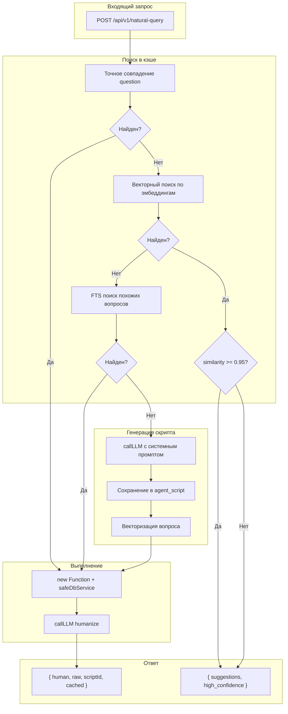

# Natural Query Engine для KOSMOS-VECTOR

## Описание

Natural Query Engine — интеллектуальный слой для анализа кодовой базы: пользователь задаёт вопрос на естественном языке, система автоматически генерирует JS-скрипт, выполняет его в sandbox и возвращает структурированный JSON-ответ.

## Архитектура



## Структура файлов

| Файл | Назначение |
|------|------------|
| `routes/agentScript.js` | Роутер: CRUD для agent_scripts + natural-query эндпоинт |
| `packages/core/DbService.js` | Методы: queryRaw, getAgentScriptByExactQuestion, fuzzySearchScripts, saveAgentScript, incrementUsage |
| `packages/core/scriptSandbox.js` | Модуль: executeScript() + validateScript() |
| `packages/core/naturalQueryPrompts.js` | Промпты: getScriptGenerationPrompt, getHumanizePrompt |

## API эндпоинты

### POST /api/v1/natural-query

Основной эндпоинт для запросов на естественном языке.

**Запрос:**
```json
{
  "question": "Какие функции вызывает api_auct?",
  "contextCode": "CARL"
}
```

**Ответ (успешный):**
```json
{
  "success": true,
  "human": "Функция api_auct вызывает 3 других функции: helper_fn, validate_data, save_result",
  "raw": [
    { "source": "api_auct", "target": "helper_fn", "type": "calls" },
    { "source": "api_auct", "target": "validate_data", "type": "calls" }
  ],
  "scriptId": 42,
  "cached": false
}
```

**Ответ (ошибка выполнения):**
```json
{
  "success": false,
  "error": "Script execution failed: rows is not defined",
  "human": "Ошибка в скрипте: переменная 'rows' не определена. Проверьте сгенерированный скрипт и убедитесь, что все переменные правильно объявлены.",
  "scriptId": 42,
  "script": "async function execute(contextCode) { const rows = ... }",
  "cached": false
}
```

### CRUD для agent-scripts

| Метод | Эндпоинт | Описание |
|-------|----------|----------|
| GET | `/api/agent-scripts?context-code=XXX` | Список скриптов |
| GET | `/api/agent-scripts/:id?context-code=XXX` | Детали скрипта |
| PUT | `/api/agent-scripts/:id?context-code=XXX` | Редактирование (script, is_valid) |
| DELETE | `/api/agent-scripts/:id?context-code=XXX` | Удаление скрипта |

## Ключевые компоненты

### 1. Sandbox (packages/core/scriptSandbox.js)

Безопасное выполнение скриптов через `new Function()` с изоляцией scope:

```javascript
async function executeScript(scriptCode, contextCode, dbService, timeoutMs = 5000) {
  // Валидация формата
  if (!scriptCode.includes('async function execute')) {
    throw new Error('Script must contain "async function execute(contextCode)"');
  }
  
  // Безопасная обёртка для DbService (только SELECT)
  const safeDbService = {
    queryRaw: async (sql, params = []) => {
      if (!sql.trim().toUpperCase().startsWith('SELECT')) {
        throw new Error('Only SELECT queries are allowed in scripts');
      }
      return dbService.queryRaw(sql, params);
    }
  };
  
  // Создаём функцию с инъекцией DbService
  const executeFn = new Function('DbService', `
    ${scriptCode}
    return execute;
  `)(safeDbService);
  
  // Выполняем с таймаутом
  return Promise.race([
    executeFn(contextCode),
    new Promise((_, reject) => 
      setTimeout(() => reject(new Error('Timeout')), timeoutMs)
    )
  ]);
}
```

### 2. Двухэтапный поиск в кэше

#### 2.1. Точное совпадение (getAgentScriptByExactQuestion)

Сначала выполняется проверка точного совпадения вопроса для мгновенного кэширования:

```sql
SELECT id, question, script
FROM public.agent_script
WHERE context_code = $1 AND question = $2 AND is_valid = true
LIMIT 1
```

**Преимущества:**
- Мгновенный результат без вызова LLM
- Использует индекс на `(context_code, question)`
- Не требует FTS-поиска для точных совпадений

#### 2.2. FTS поиск похожих вопросов (fuzzySearchScripts)

Если точное совпадение не найдено, выполняется FTS-поиск для похожих вопросов. Использует GIN-индекс на `to_tsvector('russian', question)`:

```sql
SELECT id, question, script, 
       ts_rank(to_tsvector('russian', question), plainto_tsquery('russian', $1)) as rank
FROM public.agent_script
WHERE context_code = $2
  AND to_tsvector('russian', question) @@ plainto_tsquery('russian', $1)
  AND is_valid = true
ORDER BY rank DESC, usage_count DESC
LIMIT 1
```

#### 2.3. Векторный поиск по эмбеддингам (searchSimilarQuestions)

Если точное совпадение не найдено, выполняется векторный поиск по эмбеддингам вопросов. Использует cosine similarity для поиска семантически похожих вопросов:

```sql
SELECT 
  ase.script_id AS id,
  as_script.question,
  as_script.script,
  as_script.usage_count,
  as_script.is_valid,
  as_script.last_result,
  1 - (ase.question_embedding <=> $1::vector) AS similarity
FROM public.agent_script_embedding ase
JOIN public.agent_script as_script ON ase.script_id = as_script.id
WHERE as_script.context_code = $2
  AND as_script.is_valid = true
  AND (1 - (ase.question_embedding <=> $1::vector)) >= $3
ORDER BY similarity DESC
LIMIT $4
```

**Логика работы:**
- Если `similarity >= 0.95` → возвращается 1 suggestion с `high_confidence: true` (рекомендация к использованию)
- Если `similarity >= threshold (0.8)` → возвращается список suggestions с `high_confidence: false` (пользователь выбирает)
- Если векторный поиск не дал результатов → используется FTS поиск как fallback

**Преимущества:**
- Семантический поиск (понимает синонимы и перефразировки)
- Использует IVFFlat индекс для быстрого поиска
- Автоматическая векторизация при сохранении нового скрипта

**Порог релевантности:** по умолчанию `threshold = 0.1`. Если ранг совпадения ниже порога, скрипт не используется.

**Логика поиска:**
1. Сначала проверяется точное совпадение — если найдено, скрипт используется без LLM
2. Если точного совпадения нет, выполняется FTS-поиск похожих вопросов
3. Если FTS ничего не нашёл или ранг слишком низкий, генерируется новый скрипт через LLM

### 3. Системный промпт (naturalQueryPrompts.js)

Содержит:
- Описание доступных инструментов (DbService.queryRaw, fetch к /api/*)
- Справочник типов связей (link_type): calls, reads_from, updates, inserts_into, imports
- Схему ключевых таблиц: ai_item, link, link_type, chunk_vector, files
- 5 few-shot примеров типовых аналитических запросов

### 4. Методы DbService

| Метод | Описание |
|-------|----------|
| `queryRaw(sql, params)` | Выполнение SELECT и WITH (CTE) запросов |
| `getAgentScriptByExactQuestion(contextCode, question)` | Поиск скрипта по точному совпадению вопроса (используется первым для быстрого кэширования) |
| `searchSimilarQuestions(contextCode, embedding, limit, threshold)` | Векторный поиск похожих вопросов по эмбеддингам (cosine similarity) |
| `saveQuestionEmbedding(scriptId, embedding)` | Сохранение эмбеддинга вопроса для векторного поиска |
| `getQuestionEmbedding(scriptId)` | Получение эмбеддинга вопроса по script_id |
| `fuzzySearchScripts(contextCode, question, threshold)` | FTS-поиск похожих скриптов (fallback если векторный поиск не дал результатов) |
| `saveAgentScript(contextCode, question, script, isValid)` | Сохранение скрипта (автоматически векторизует вопрос) |
| `incrementUsage(scriptId)` | Инкремент счётчика использования |

## Таблица agent_script

```sql
CREATE TABLE public.agent_script (
    id serial PRIMARY KEY,
    context_code text NOT NULL,
    question text NOT NULL,
    script text NOT NULL,
    created_at timestamp with time zone DEFAULT CURRENT_TIMESTAMP,
    updated_at timestamp with time zone DEFAULT CURRENT_TIMESTAMP,
    usage_count int DEFAULT 0,
    is_valid boolean DEFAULT false,
    last_result jsonb DEFAULT NULL
);

CREATE UNIQUE INDEX idx_agent_script_unique 
    ON public.agent_script (context_code, question);

CREATE INDEX idx_agent_script_question_fts 
    ON public.agent_script USING gin (to_tsvector('russian', question));
```

### Поля таблицы

| Поле | Тип | Описание |
|------|-----|----------|
| `id` | serial | Уникальный идентификатор скрипта |
| `context_code` | text | Контекстный код для изоляции данных |
| `question` | text | Вопрос пользователя на естественном языке |
| `script` | text | Сгенерированный JavaScript код скрипта |
| `created_at` | timestamp | Дата и время создания скрипта |
| `updated_at` | timestamp | Дата и время последнего обновления (автообновление через триггер) |
| `usage_count` | int | Счётчик использования скрипта (инкрементируется при каждом использовании из кэша) |
| `is_valid` | boolean | Флаг валидности скрипта (false если скрипт привёл к ошибке при выполнении) |
| `last_result` | jsonb | Последний результат выполнения скрипта в формате: `{ raw: [...], human: "...", executed_at: "..." }` |

## Таблица agent_script_embedding

Таблица для хранения эмбеддингов вопросов для векторного поиска:

```sql
CREATE TABLE public.agent_script_embedding (
    id serial PRIMARY KEY,
    script_id int NOT NULL REFERENCES public.agent_script(id) ON DELETE CASCADE,
    question_embedding vector(1536) NOT NULL,
    created_at timestamp with time zone DEFAULT CURRENT_TIMESTAMP
);

CREATE UNIQUE INDEX idx_agent_script_embedding_script_id 
    ON public.agent_script_embedding (script_id);

CREATE INDEX idx_agent_script_embedding_vector 
    ON public.agent_script_embedding 
    USING ivfflat (question_embedding vector_cosine_ops)
    WITH (lists = 100);
```

### Поля таблицы

| Поле | Тип | Описание |
|------|-----|----------|
| `id` | serial | Уникальный идентификатор эмбеддинга |
| `script_id` | int | Ссылка на скрипт в таблице agent_script |
| `question_embedding` | vector(1536) | Вектор эмбеддинга вопроса (1536 измерений) |
| `created_at` | timestamp | Дата и время создания эмбеддинга |

**Примечание:** Эмбеддинг создаётся автоматически при сохранении нового скрипта через `saveAgentScript`.

## Настройки

Настройки векторного поиска находятся в `config.json`:

```json
{
  "NATURAL_QUERY_SUGGEST_LIMIT": 5,
  "NATURAL_QUERY_SIMILARITY_THRESHOLD": 0.8,
  "NATURAL_QUERY_AUTO_USE_THRESHOLD": 0.95
}
```

| Параметр | Описание | По умолчанию |
|----------|----------|--------------|
| `NATURAL_QUERY_SUGGEST_LIMIT` | Максимальное количество suggestions в ответе | 5 |
| `NATURAL_QUERY_SIMILARITY_THRESHOLD` | Минимальный порог similarity для включения в результаты | 0.8 |
| `NATURAL_QUERY_AUTO_USE_THRESHOLD` | Порог similarity для high_confidence (>= 0.95 возвращает 1 suggestion) | 0.95 |

## Эндпоинт /api/v1/natural-query/suggest

Отдельный эндпоинт для получения списка похожих вопросов без выполнения скрипта:

**POST** `/api/v1/natural-query/suggest`

**Request Body:**
```json
{
  "question": "Какие функции вызывают другие функции?",
  "contextCode": "CARL"
}
```

**Query Parameters:**
- `limit` (optional) - Максимальное количество результатов (по умолчанию из config.json)
- `threshold` (optional) - Минимальный порог similarity (по умолчанию из config.json)

**Response:**
```json
{
  "success": true,
  "high_confidence": true,
  "suggestions": [
    {
      "id": 42,
      "question": "Какие типы связей используются в проекте?",
      "similarity": 0.97,
      "usage_count": 15,
      "is_valid": true,
      "last_result": {
        "raw": [{ "code": "calls", "label": "calls" }],
        "human": "В проекте используются следующие типы связей...",
        "executed_at": "2024-01-15T10:30:00.000Z"
      }
    }
  ]
}
```

## Миграция существующих вопросов

Для векторизации существующих вопросов в таблице `agent_script` используйте скрипт миграции:

```bash
node tmp/migrate_question_embeddings.js
```

Скрипт:
1. Находит все скрипты без эмбеддингов
2. Векторизует каждый вопрос через `embeddings.embedQuery()`
3. Сохраняет эмбеддинги в `agent_script_embedding`

**Примечание:** Новые скрипты автоматически векторизуются при сохранении через `saveAgentScript`.

**Примечание:** Поле `last_result` автоматически обновляется при каждом успешном выполнении скрипта и позволяет быстро получить последний результат без повторного выполнения.

## Обработка ошибок

При ошибках выполнения скрипта API возвращает детальную информацию:

- **Поле `error`**: Техническое описание ошибки (для разработчиков)
- **Поле `human`**: Человекочитаемое описание ошибки на русском языке
- **Поле `script`**: Код сгенерированного скрипта для отладки
- **Поле `scriptId`**: ID скрипта, который пытались выполнить
- **Поле `cached`**: Был ли скрипт из кэша или сгенерирован заново

Специальная обработка ошибок типа "is not defined" — система автоматически определяет имя переменной и формирует понятное сообщение.

## Безопасность

- `new Function()` вместо eval() для изоляции scope
- Таймаут 5 сек через `Promise.race()`
- `safeDbService.queryRaw()` разрешает только SELECT-запросы
- Валидация скриптов на опасные паттерны (eval, require, process, fs и т.д.)
- Скрипт помечается `is_valid = false` при ошибке выполнения
- FTS-поиск учитывает только валидные скрипты (`is_valid = true`)

## Frontend UI (NaturalQueryDialog)

Инструмент реализован как компактный плавающий виджет, доступный из **Knowledge Graph** и **Inspector**.

### Основные возможности UI:
1.  **Плавающий интерфейс:**
    *   **Non-modal**: Не блокирует основной интерфейс, позволяя взаимодействовать с графом во время анализа.
    *   **Draggable**: Свободное перемещение по экрану за заголовок.
    *   **Resizable**: Возможность изменять размер окна для комфортной работы с кодом.
2.  **Умный ввод (Smart Input):**
    *   **Autocomplete**: Предлагает варианты из истории успешных запросов при вводе.
    *   **Навигация**: Поддержка управления стрелками (Вверх/Вниз) для выбора из списка.
    *   **Редактирование**: Выбор из списка подставляет текст, но позволяет внести правки перед запуском.
3.  **Визуализация результата:**
    *   **Interpretation**: Текстовое описание ответа на человеческом языке.
    *   **Agent Script**: Просмотр сгенерированного JS-кода с **подсветкой синтаксиса** (Keywords, Strings, SQL).
    *   **Raw Data**: Просмотр сырых данных в формате JSON.
    *   **Copy to Clipboard**: Быстрое копирование кода скрипта во вкладке Agent Script.
4.  **Интеграция с графом:**
    *   Кнопка **"Apply to Filter"** мгновенно применяет результаты анализа к фильтру графа, подсвечивая нужные узлы.

## Пример использования

```javascript
// Запрос через API
const response = await fetch('http://localhost:3001/api/v1/natural-query', {
  method: 'POST',
  headers: { 'Content-Type': 'application/json' },
  body: JSON.stringify({
    question: 'Топ-10 самых вызываемых функций',
    contextCode: 'CARL'
  })
});

const result = await response.json();
console.log(result.human);  // "Топ-10 функций по количеству вызовов: ..."
console.log(result.raw);    // [{ called_function: 'fn1', calls_count: 42 }, ...]
```
