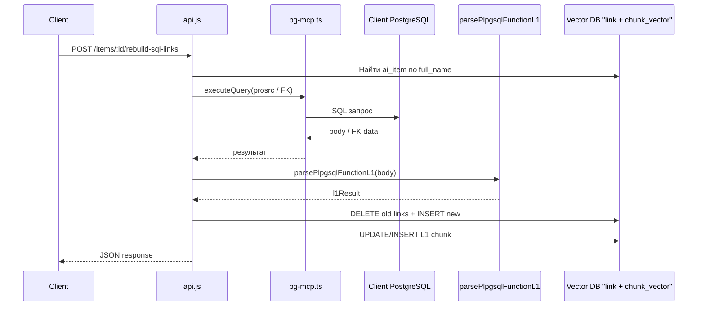

# POST /api/items/:id/rebuild-sql-links

## Архитектура




## Что добавляется

### 1. Файл `routes/loaders/rebuildSqlLinks.js` (новый модуль)

Выделяем логику в отдельный модуль (по аналогии с `columnExtractor.js`):

**Функция `rebuildSqlLinksFromDb(fullName, contextCode, dbService)`:**

- Парсит `full_name` -> `schema` + `name` (split по `.`)
- Находит `ai_item` в локальной БД, проверяет `type`
- **Для функций (type = 'function'):**
  - Через `pgMcp.executeQuery()` запрашивает `prosrc` из клиентской БД:

```sql
    SELECT p.prosrc 
    FROM pg_proc p JOIN pg_namespace n ON p.pronamespace = n.oid
    WHERE n.nspname = '<schema>' AND p.proname = '<name>'
    

```

- Оборачивает тело в `CREATE FUNCTION ... AS $$ ... $$ LANGUAGE plpgsql;` (парсер `parsePlpgsqlFunctionL1` из [sqlFunctionLoader.js](routes/loaders/sqlFunctionLoader.js) ожидает полный CREATE FUNCTION)
- Прогоняет через `parsePlpgsqlFunctionL1(wrappedCode)`
- linkTypeMap: `{ called_functions: 'calls', select_from: 'reads_from', update_tables: 'updates', insert_tables: 'inserts_into' }`
- **Для таблиц (type = 'table'):**
  - Через `pgMcp.executeQuery()` запрашивает FK:

```sql
    SELECT kcu.column_name, ccu.table_schema || '.' || ccu.table_name AS referenced_table, ccu.column_name AS referenced_column
    FROM information_schema.table_constraints tc
    JOIN information_schema.key_column_usage kcu ON tc.constraint_name = kcu.constraint_name AND tc.table_schema = kcu.table_schema
    JOIN information_schema.constraint_column_usage ccu ON ccu.constraint_name = tc.constraint_name
    WHERE tc.constraint_type = 'FOREIGN KEY' AND tc.table_schema = '<schema>' AND tc.table_name = '<name>'
    

```

- Формирует l1Result: `{ foreign_keys: [...], referenced_tables: [...] }`
- linkTypeMap: `{ referenced_tables: 'reads_from' }` (FK — это по сути ссылка на другую таблицу)
- **Общая часть (после получения l1Result):**
  1. `DELETE FROM kosmos.link WHERE source = $1 AND context_code = $2` — очищаем старые связи
  2. Резолвим link_type_id через `SELECT id FROM kosmos.link_type WHERE code = $1`
  3. INSERT новых связей через `INSERT INTO kosmos.link ... ON CONFLICT DO NOTHING`
  4. Обновляем L1-чанк в chunk_vector:
    - Ищем существующий: `SELECT id FROM chunk_vector WHERE ai_item_id = $1 AND level LIKE '1-%'`
    - Если есть — `UPDATE chunk_vector SET chunk_content = $1 WHERE id = $2`
    - Если нет — `saveChunkVector(...)` + привязка к ai_item_id
- Возвращает report: `{ fullName, type, linksDeleted, linksCreated, l1Result, chunkUpdated }`

### 2. Эндпоинт в [routes/api.js](routes/api.js)

Добавляем после блока `extract-columns` (~строка 1125):

```javascript
router.post('/items/:id/rebuild-sql-links', async (req, res) => { ... });
```

Паттерн 1-в-1 как у `/items/:id/extract-columns` (строки 1073-1125):

- `decodeURIComponent(req.params.id)`
- `req.contextCode`
- Вызов `rebuildSqlLinksFromDb(decodedId, contextCode, dbService)`
- JSON response с `{ success, report }`

### Важные детали

- PostgreSQL хранит имена в lowercase — при запросе к `pg_proc` делаем `.toLowerCase()` для schema и name
- `pg-mcp.ts` не поддерживает параметризованные запросы — значения вставляются в строку (безопасно, т.к. из ai_item full_name)
- `executeQuery` возвращает `{ columns: string[], rows: any[][] }` — rows это массивы массивов
- `parsePlpgsqlFunctionL1` экспортирована из `sqlFunctionLoader.js` — нужно проверить, что она в `module.exports`
- Для таблиц без FK — возвращаем success с 0 связей (не ошибка)

